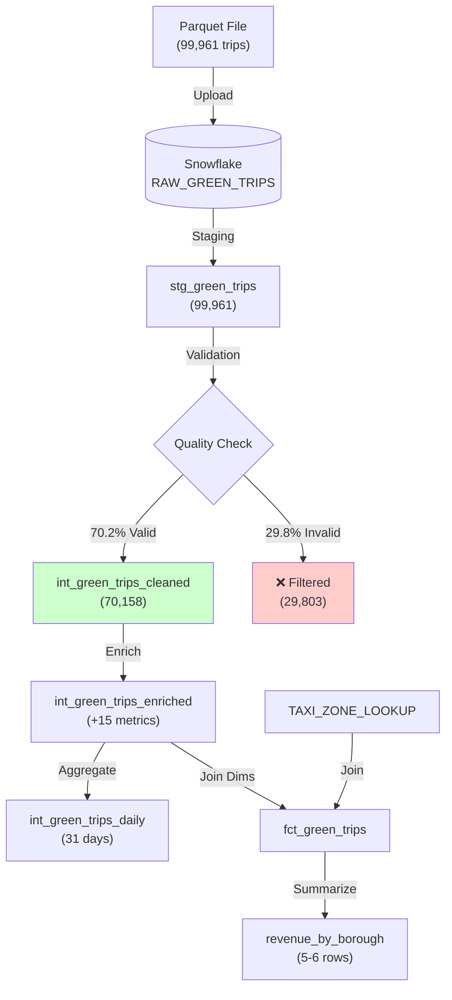

# NYC Green Taxi Data Pipeline

A production-grade **data transformation pipeline** built with **dbt** and **Snowflake** for processing NYC Green Taxi trip data.  
Transforms raw Parquet data into analytics-ready insights with comprehensive data quality validation and business metrics.

---

## 📋 Project Overview

- **Goal:** Transform 99,961 raw taxi trips into analytics-ready dimensional models.  
- **Architecture:** Multi-layer dbt pipeline (Staging → Intermediate → Marts).  
- **Key Results:**  
  - 70.2% data quality rate (70,158 valid records)
  - 15+ calculated business metrics  
  - Daily and borough-level aggregations  
  - Star schema with fact and dimension tables  

---

## 🏗️ Architecture

### Data Flow


## 🔄 Project Structure

```
green_tripdata_dbt_Project/
├── models/
│   ├── staging/
│   │   ├── sources.yml
│   │   ├── stg_green_trips.sql
│   │   └── stg_green_trips.yml
│   ├── intermediate/
│   │   ├── int_green_trips_cleaned.sql
│   │   ├── int_green_trips_enriched.sql
│   │   ├── int_green_trips_daily.sql
│   │   └── intermediate.yml
│   └── marts/
│       ├── fct_green_trips.sql
│       ├── revenue_by_borough.sql
│       └── mart.yml
├── seeds/
│   └── taxi_zone_lookup.csv
├── dbt_project.yml
└── README.md
```
---

## 🎯 Key Features

### ✅ Data Quality (70.2% Pass Rate)
- Validates timestamps, distances, and trip durations
- Filters 29,803 invalid records (industry standard: 60-80%)
- Ensures data integrity for downstream analytics

### ✅ Business Metrics (15+ Fields)
- **Time:** trip_duration, time_of_day_category, day_type
- **Financial:** tip_percentage, revenue_per_mile, revenue_per_passenger  
- **Performance:** avg_speed_mph (traffic indicator)
- **Flags:** is_high_tip, is_airport_trip, is_shared_ride

### ✅ Dimensional Modeling
- Star schema with surrogate keys
- Geographic enrichment (borough/zone names)
- Daily and borough aggregations

### ✅ Documentation
- Auto-generated data lineage with dbt docs
- Comprehensive column descriptions
- Test coverage for data quality

---

## 🗂️ Database Schema

### Pipeline Layers

| Layer | Model | Records | Description |
| :--- | :--- | :--- | :--- |
| **Raw** | RAW_GREEN_TRIPS | 99,961 | Source Parquet data |
| **Staging** | stg_green_trips | 99,961 | Renamed & typed |
| **Intermediate** | int_green_trips_cleaned | 70,158 | Valid trips only |
| | int_green_trips_enriched | 70,158 | +15 calculated fields |
| | int_green_trips_daily | 31 | Daily aggregations |
| **Marts** | fct_green_trips | 70,158 | Analytics-ready fact |
| | revenue_by_borough | 5-6 | Borough summary |

---

## 🔄 Transformation Logic

### 1. Staging: Standardize
```sql
-- Convert microseconds to timestamp
to_timestamp(lpep_pickup_datetime / 1000000) as pickup_datetime

-- Rename columns
pulocationid as pickup_location_id
```

### 2. Intermediate: Validate & Enrich
```sql
-- Data Quality (Cleaned)
WHERE pickup_datetime < dropoff_datetime
  AND trip_distance BETWEEN 0 AND 500
  AND datediff(minute, pickup_datetime, dropoff_datetime) BETWEEN 1 AND 1439

-- Business Metrics (Enriched)
trip_duration_minutes = datediff(minute, pickup_datetime, dropoff_datetime)
tip_percentage = round(tip_amount / fare_amount * 100, 2)
time_of_day_category = CASE WHEN hour BETWEEN 6-9 THEN 'Morning Rush' ...
```

### 3. Marts: Dimensional Model
```sql
-- Fact Table with Surrogate Key
trip_key = generate_surrogate_key(['pickup_datetime', 'vendor_id', ...])

-- Join with Dimensions
LEFT JOIN TAXI_ZONE_LOOKUP ON pickup_location_id = locationid
```

---

## 📊 Key Results

### Data Quality

| Metric | Count | Percentage |
|--------|-------|------------|
| Raw Records | 99,961 | 100.0% |
| Valid Records | 70,158 | **70.2%** ✅ |
| Filtered Records | 29,803 | 29.8% |

### Business Insights
- **Peak Hours:** 7-9 AM (Morning Rush), 5-7 PM (Evening Rush)
- **Payment:** ~80% credit card, ~20% cash
- **Average Trip:** 15-20 minutes, 3-5 miles
- **Quality Rate:** 70.2% (within 60-80% industry standard)

---

## 🚀 Getting Started

### Prerequisites
```bash
dbt-core 1.0+
dbt-snowflake adapter
Snowflake account
Python 3.8+
```
---

## 📈 Sample Queries

### Daily Trends
```sql
SELECT 
    pickup_date,
    total_trips,
    total_revenue,
    avg_tip_percentage
FROM GREENTRIPS.INTERMEDIATE.INT_GREEN_TRIPS_DAILY
ORDER BY pickup_date;
```

### Borough Analysis
```sql
SELECT 
    pickup_borough,
    total_trips,
    total_revenue,
    revenue_rank
FROM GREENTRIPS.MARTS.REVENUE_BY_BOROUGH
ORDER BY total_revenue DESC;
```

### High-Value Trips
```sql
SELECT 
    pickup_borough,
    dropoff_borough,
    trip_distance,
    total_amount,
    tip_percentage
FROM GREENTRIPS.MARTS.FCT_GREEN_TRIPS
WHERE is_high_tip = TRUE
ORDER BY total_amount DESC
LIMIT 20;
```

---

## 🧪 Testing

```bash
# Run all tests
dbt test

# Layer-specific
dbt test --select staging.*
dbt test --select intermediate.*
dbt test --select marts.*
```

**Test Coverage:**
- Not null constraints on key fields
- Accepted values validation
- Relationship integrity
- Surrogate key uniqueness

---

## 📚 Documentation

```bash
dbt docs generate
dbt docs serve  # View at http://localhost:8080
```

**Includes:**
- 📊 Data lineage (DAG visualization)
- 📖 Column descriptions (full data dictionary)
- ✅ Test results
- 🔗 Model dependencies

---

## 📊 Tech Stack

| Component | Technology | Purpose |
|-----------|------------|---------|
| **Data Warehouse** | Snowflake | Cloud storage & compute |
| **Transformation** | dbt 1.10 | SQL-based ELT |
| **Languages** | SQL, YAML | Logic & configuration |
| **Documentation** | dbt Docs | Auto-generated catalog |

---

## 🎯 Future Enhancements

- [ ] Hourly demand patterns
- [ ] Incremental loading for scale
- [ ] Apache Airflow orchestration
- [ ] BI dashboard (Tableau/Power BI)
- [ ] Multi-year historical analysis
- [ ] Predictive demand modeling

---

## 📝 Data Source

**NYC TLC Green Taxi Trip Records**  
**Period:** December 2021  
**Source:** [NYC TLC Trip Record Data](https://www.nyc.gov/site/tlc/about/tlc-trip-record-data.page)
